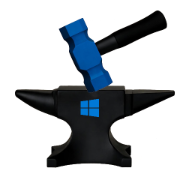

<div align="center">

<h1>WinForge</h1>
</div>

The ultimate all-in-one guide for optimizing Windows 11. Integrate WinUtil debloating, MicroWin minimalism, WinHance enhancements, custom DNS, desktop tweaks, Edge removal, and Brave installation for a streamlined, privacy-focused setup

> [!IMPORTANT]
> I am not a developer. I am just a guy who loves to customise things the way I want. Whatever script, software, tool I use it all copyright & credited to their respectable owners

<Br>
Now that out of the way then we can start the fun part.
<Br>

## 🪄 Installation
1. Download the zip from the latest release
2. Unzip it from any of the Unzipping Programs
3. Open `Terminal (Admin)` by right clicking on start button
4. Run this command.

> This is a Powershell script that is not digitally signed so you need to run some commands.

```
Set-ExecutionPolicy RemoteSigned
```

Then `cd path` 
> remove the "path" with the actual path of the folder. <br>
> Eg - `cd C:\WinForge`

```
.\WinForge-OptionalSetup.ps1
```
5. I have also provided some files for Chris Titus Utlity & Winhance. That you can import in those apps and make the process more streamlined. All the `Import Files` are labeled.

And you're done. The script will ask you questions of what you wanna do?[^1]

[^1]: The default is set to NO.

<br>

## 📲 Import Configrations and Files
### For Chris Titus Utility


1. Let this screen be opened.
2. Click on the Gear (Settings icon) at the top right corner as illustrated in the [image](assets\images\ChrisTitus-Import.png)
3. A menu will open to **Import** the configuration
4. Go to `Install` section and select the apps you wanna install
5. `Tweaks`section is the best & highly configured and if you don't know what every thing is saying, just click **Run Tweaks** at the bootom left side

> [!NOTICE]
> If you have downloaded the zip format then it has the pre configured import files for both Chris Titus Utility and Winhance

### For Winhance


1. Let this screen be opened,
2. Click on the **Folder** like icon in upper right corner as illustrated in the [image](assets\images\Winhance-import.png)
3. then Import the configrations

Enjoy 🎉

## ⚙️ Workings 
If you wanna see the workings, either check the `Source Code` or [visit this page](docs/working.md)

## 💫 Credits
* Chris Titus Tech- [WinUtil](https://github.com/ChrisTitusTech/winutil)
* Mestechtips - [WinHance](https://github.com/memstechtips/Winhance)
* Cloudflare - [Cloudflare DNS](https://developers.cloudflare.com/1.1.1.1/setup/)
* Adguard - [Adguard DNS](https://adguard-dns.io/en/public-dns.html)

## ☕ Sponsor the Forge
If this sparked joy (or saved your sanity), fuel the fire!

<div align="center">

<table>
  <tr>
    <td>
      <a href="https://www.buymeacoffee.com/mrdarksidetm" target="_blank"></a>
    </td>
    <td>
      <a href="https://ko-fi.com/H2H21N0OAT" target="_blank">
</a>
    </td>
    <td>
      <a href="https://www.upi.me/pay?pa=abhisidetm@ptyes&am=150" target="_blank"></a>
    </td>
  </tr>
</table>
</div>
<br>

**🌟 Future Tease:** Signed EXE wrapper incoming—stay tuned via Releases. Questions? Open an Issue. Let's build better Windows, one forge at a time.