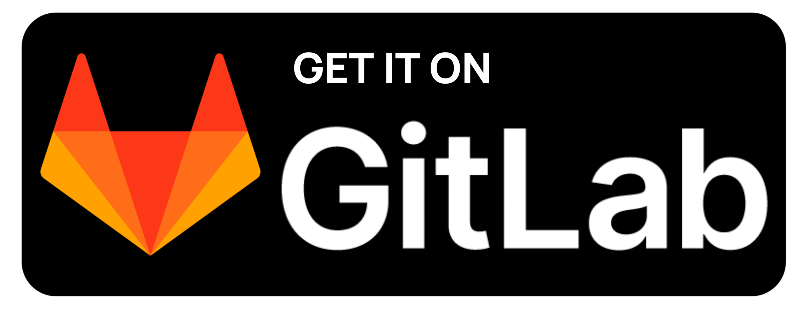
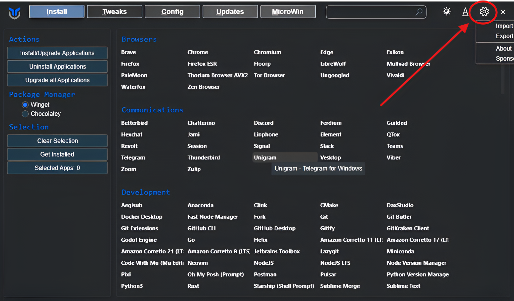

<div align="center">
 <!-- Added the WinForge Logo -->
<h1>WinForge</h1>

<!-- From line 6 to 10 added License, Last commit, New Release, Stars, Assests Download Tracker-->
<a href="LICENSE"></a> 
<a href="https://github.com/mrdarksidetm/WinForge/commits"></a>
<a href="https://github.com/mrdarksidetm/WinForge/releases/latest"></a>
<a href=""></a>
<a href=""></a>

<h3>WinForge: The Ultimate Win 11 Experience</h3>

[Features](https://github.com/mrdarksidetm/WinForge?tab=readme-ov-file#-main-features) • [Installation](https://github.com/mrdarksidetm/WinForge?tab=readme-ov-file#-installation) • [Contact](https://github.com/mrdarksidetm/WinForge?tab=readme-ov-file#-contact) • [License](https://github.com/mrdarksidetm/WinForge?tab=readme-ov-file#-license)

<!-- For releases in both Github and Gitlab -->
<a href="https://github.com/mrdarksidetm/WinForge/releases/latest"></a>
<a href="https://gitlab.com/mrdarksidetm/WinForge/releases/latest"></a>

</div>

 <!-- WinForge Banner -->

## 🌟 Main Features

* **🛠️ Chris Titus WinUtil Integration:** One-click debloating, optimization, and Windows customization using industry-standard utilities with preset configurations​
* **🚀 System Performance Boost:** Remove bloatware, disable unnecessary services, optimize startup programs, and maximize system resource efficiency for faster performance​

* **🧹 Smart Debloating:** Safely remove pre-installed Windows apps (Cortana, OneDrive notifications, Xbox, Games), telemetry services, and unwanted background processes while maintaining system stability​

* **🔒 Privacy & Security Hardening:** Disable telemetry, disable data collection, disable Cortana tracking, block invasive Windows services, and implement security best practices without breaking functionality​

* **📲 Edge Browser Removal:** One-click removal of Microsoft Edge using Winhance utility with automatic replacement options and system cleanup​

* **🌐 DNS Optimization with DoH:** Two DNS profiles (AdGuard with ad-blocking or Cloudflare for speed) with encrypted DNS-over-HTTPS (DoH) for privacy and performance​

* **🔐 Ad-Blocking DNS:** AdGuard DNS automatically blocks ads, malware, and phishing sites across all applications without additional software​

* **⚡ Speed Optimized DNS:** Cloudflare DNS (1.1.1.1) for maximum internet speed with privacy protection and DNSSEC validation​

* **🔐 DNS-over-HTTPS (DoH):** Military-grade encryption for all DNS queries preventing ISP/network monitoring and DNS hijacking attacks​

* **🌍 IPv4 & IPv6 Support:** Dual-stack DNS configuration for both IPv4 and IPv6 networks with automatic fallback for compatibility​

* **🧩 WebView2 Runtime Auto-Install:** Automatic installation of Microsoft WebView2 Runtime after Edge removal to maintain app compatibility (no broken applications)​

* **🎨 Terminal Customization:** Oh My Posh theme engine installation with hul10 professional theme for beautiful PowerShell 7 terminal with git integration and powerline fonts​

* **💾 Comprehensive Logging:** Automatic session transcript logging to Winforge_Logs/ with timestamp, errors exported to both TXT and JSON formats for troubleshooting and auditing​

* **🛡️ Secure Download Verification:** SHA-256 hash verification for all downloaded scripts/executables with security warnings before execution​

* **⚙️ Group Policy Detection:** Automatic detection of Group Policy DNS settings with warnings to prevent overriding corporate/managed configurations​

WinForge is your complete Windows 11 optimization toolkit - fast, secure, and professional-grade! 🎉

# 🪄 Installation

**This is a Powershell script that is not digitally signed so you need to run some commands.**

1. Download the zip from the latest [releases](https://github.com/mrdarksidetm/WinForge/releases/latest) <!-- Link to the latest release -->
2. Unzip it from any of the Unzipping Program
3. Open `Terminal (Admin)` by right clicking on start button
4. Paste this command.

```powershell.exe
Set-ExecutionPolicy Unrestricted -Scope CurrentUser
cd "Downloads\WinForge" #remove the "path" with the actual path of the folder. 
.\WinForge-OptionalSetup.ps1
```

# 📲 Import Configrations and Files

I have also provided some files for **Chris Titus Utility** & **Winhance**. That you can import in those apps and make the process more streamlined. All the `Import Files` are labeled.

> [!NOTE]
> If you have downloaded the zip format then it contains the pre configured import files for both **Chris Titus Utility** and **Winhance**

And you're done. The script will ask you questions of what you wanna do?
If you wanna know the exact things that the script is gonna do then [visit this page](docs/working.md)</n> <!-- Linked new page for all the code actions and steps it will perform -->

The default is set to **NO**.

## For Chris Titus Utility



1. Let this screen be opened.
2. Click on the Gear (Settings icon) at the top right corner as illustrated in the [image](assets/images/ChrisTitus-Import.png)
3. A menu will open to **Import** the configuration
4. Go to `Install` section and select the apps you wanna install
5. `Tweaks`section is the best & highly configured and if you don't know what every thing is saying, just click **Run Tweaks** at the bootom left side

## For Winhance


1. Let this screen be opened,
2. Click on the **Folder** like icon in upper right corner as illustrated in the [image](assets/images/Winhance-import.png)
3. then Import the configrations

Enjoy 🎉

## ⚙️ Workings

If you wanna see the workings, either check the `Source Code` or [visit this page](docs/working.md)

## 💫 Credits

* Chris Titus Tech- [WinUtil](https://github.com/ChrisTitusTech/winutil)
* Mestechtips - [WinHance](https://github.com/memstechtips/Winhance)
* Cloudflare - [Cloudflare DNS](https://developers.cloudflare.com/1.1.1.1/setup/)
* Adguard - [Adguard DNS](https://adguard-dns.io/en/public-dns.html)

# ✉️ Contact

For any questions or feedback, feel free to open an issue on GitHub or contact [contact.dsidetm@gmail.com](mailto:contact.dsidetm@gmail.com)

# ©️ License

This project is licensed under the MIT license. See the `LICENSE` file for details.

# ☕ Sponsor the Forge

If this sparked joy (or saved your sanity), fuel the fire!

<div align="center">

<table>
  <tr>
    <td>
      <a href="https://www.buymeacoffee.com/mrdarksidetm" target="_blank"></a>
    </td>
    <td>
      <a href="https://ko-fi.com/H2H21N0OAT" target="_blank">
</a>
    </td>
    <td>
      <a href="https://www.upi.me/pay?pa=abhisidetm@ptyes&am=150" target="_blank"></a>
    </td>
  </tr>
</table>
</div>
<br>

**🌟 Future Tease:** Signed EXE wrapper incoming—stay tuned via Releases. Questions? Open an Issue. Let's build better Windows, one forge at a time.

<!--  
If you're reading that means you have visited to the depts just like I had and you alos love code and ways to customise your machine your way.
Thank you, hope our paths cross once again
But hey for today it's time to leave
Love from India <3
-->